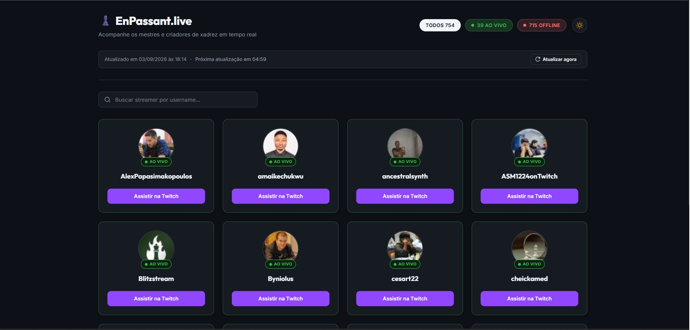
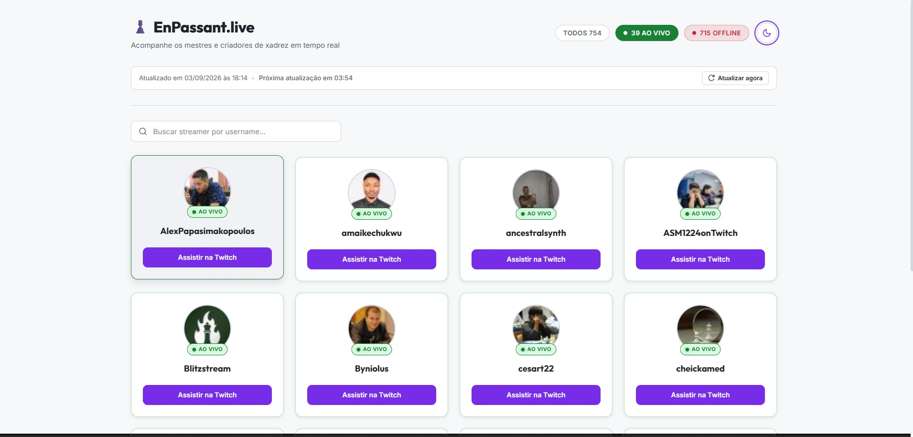
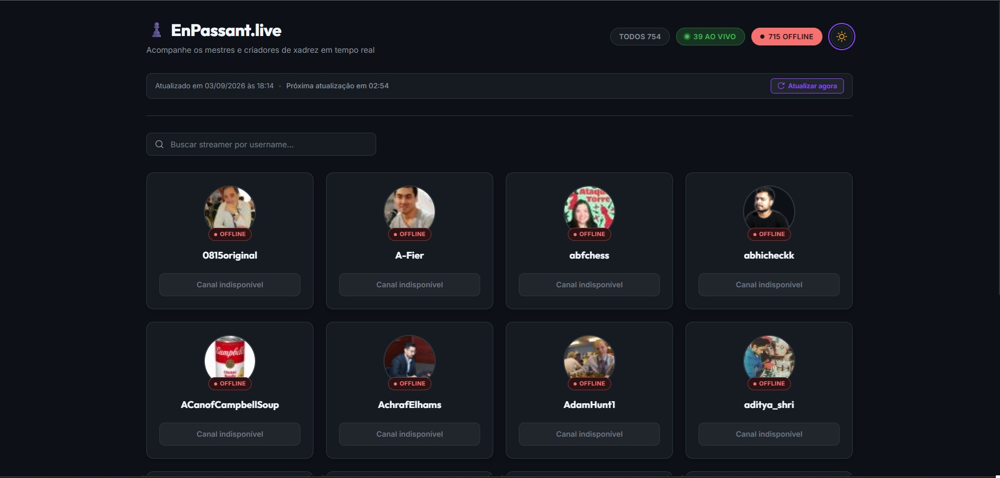

# EnPassant.live

Aplicação web em React para acompanhamento de streamers de xadrez, consumindo a API pública oficial do [Chess.com](https://www.chess.com) e realizando atualização periódica dos dados.

🔗 **Acesse a aplicação:** [https://slayer-br.github.io/enpassant.live/](https://slayer-br.github.io/enpassant.live/)

---

## Preview


*Interface principal no Modo Escuro com listagem de streamers e filtros de status.*


*Interface no Modo Claro com Design Tokens de alto contraste.*


*Busca por username combinada com filtros de status e paginação inteligente.*

---

## Funcionalidades

- **Listagem de Streamers:** Exibição em grade responsiva de cards com avatar, username, status de transmissão e link direto para o canal na Twitch.
- **Identificação de Status em Tempo Real:**
  - **AO VIVO:** Badge e indicador luminoso (*pulse glow*) para criadores transmitindo.
  - **OFFLINE:** Badge e indicador visual na tonalidade correspondente do Design System.
- **Ordenação Automática:** Priorização dos streamers ao vivo no topo da lista, seguidos pelos canais offline, ambos ordenados em ordem alfabética ($A-Z$) por nome de usuário.
- **Contadores Globais no Cabeçalho:** Contadores independentes de `TODOS`, `AO VIVO` e `OFFLINE` calculados sobre a lista completa de streamers.
- **Filtros Interativos por Status:** Segmentação por botões acessíveis no cabeçalho:
  - `TODOS`: Exibe a lista completa de criadores.
  - `AO VIVO`: Filtra exclusivamente criadores com `is_live === true`.
  - `OFFLINE`: Filtra criadores com `is_live !== true` (`false`, `null`, `undefined` ou propriedade ausente).
- **Busca Client-Side por Username:** Campo de pesquisa instantâneo com normalização de texto, busca parcial (*substring*), botão de limpeza com ícone SVG e contador de resultados encontrados.
- **Composição Cumulativa:** Os filtros por status e a busca por username funcionam simultaneamente (`statusFilter AND searchTerm`), preservando o estado selecionado ao alternar filtros ou buscar.
- **Paginação Inteligente:** Navegação com 12 streamers por página, atalhos rápidos (*Primeira*, *Anterior*, *Próxima*, *Última*), janela dinâmica com reticências (`...`) e ocultação automática quando há 12 ou menos resultados.
- **Atualização Automática e Sincronização:**
  - Ciclo de atualização periódica a cada 5 minutos (300 segundos).
  - Barra de sincronização (*Sync Bar*) com contador regressivo (`MM:SS`) e registro da última atualização.
  - Botão para sincronização manual sob demanda.
  - Sincronização automática ao retornar de abas em segundo plano via `visibilitychange`.
  - Tratamento resiliente de erros com agendamento de nova tentativa (*retry*) para 60 segundos e proteção contra requisições concorrentes.
- **Sistema de Temas (Dark & Light):** Alternância de temas com variáveis CSS (Design Tokens), ajuste da meta tag `theme-color` e persistência da preferência no `LocalStorage`.
- **Estados de Interface (Feedback Visual):**
  - *Loading State:* Esqueleto visual animado (*skeleton loader*).
  - *Error State:* Mensagem amigável com botão de nova tentativa (*retry*).
  - *Empty State:* Feedback contextual com ações de restauração para lista vazia da API, buscas sem correspondência ou filtros sem resultados.
- **Acessibilidade (a11y):** Elementos semânticos nativos, atributos `aria-pressed`, `aria-label`, `role="group"`, foco visível destacado (`:focus-visible`) e navegação completa por teclado (`Tab`, `Enter`, `Space`).
- **Design Responsivo:** Layout adaptável para dispositivos móveis (a partir de 320px), tablets e desktops.

---

## Tecnologias

- **[React 18](https://react.dev/):** Biblioteca para construção da interface de usuário com componentes funcionais e hooks (`useState`, `useEffect`, `useCallback`, `useRef`).
- **[JavaScript (ES6+)](https://developer.mozilla.org/pt-BR/docs/Web/JavaScript):** Lógica client-side, manipulação de arrays e comunicação assíncrona.
- **[Vite](https://vitejs.dev/):** Ferramenta de build rápida e servidor de desenvolvimento otimizado.
- **[CSS3 (Vanilla CSS)](https://developer.mozilla.org/pt-BR/docs/Web/CSS):** Estilização modular com CSS Custom Properties (Design Tokens), Flexbox e CSS Grid.

---

## API

A aplicação consome a API pública oficial disponibilizada pelo Chess.com:

- **Endpoint:** `https://api.chess.com/pub/streamers`
- **Método:** `GET`
- **Operação:** Requisição assíncrona via `fetch` nativo com cancelamento controlado por `AbortController`.

Os dados retornados são processados para estruturar a listagem, exibir os avatares e determinar o status de transmissão de cada canal.

---

## Como Funciona

O fluxo de dados da aplicação segue um pipeline síncrono e unidirecional:

```text
API do Chess.com (fetchStreamers)
               ↓
    sortStreamers() (Plano 00004)
(AO VIVO primeiro + A-Z por username)
               ↓
        streamers (Array)
 ├── Contadores Globais (totalCount, liveCount, offlineCount)
               ↓
    statusFilter (Plano 00008)
     ('all' | 'live' | 'offline')
               ↓
        statusFiltered
               ↓
     searchTerm (Plano 00007)
      (Username substring)
               ↓
      filteredStreamers
               ↓
    Paginação (Plano 00006)
  (12 itens por página / slice)
               ↓
     StreamerGrid / Cards
```

Toda a ordenação, filtragem por status, busca por username e paginação são processadas **client-side em memória**, garantindo respostas instantâneas sem disparar requisições adicionais à rede durante a navegação.

---

## Atualização Automática

O mecanismo de sincronização periódica implementa as seguintes regras:
- **Intervalo:** Atualização automática a cada 300 segundos (5 minutos).
- **Contador:** Temporizador regressivo calculado em relação ao timestamp de expiração (`nextUpdateAtRef`), prevenindo desvios de tempo (*drift*).
- **Preservação de Estado:** Ao receber novos dados, os filtros de status selecionados e o termo pesquisado continuam ativos.
- **Resiliência:** Em caso de indisponibilidade momentânea na rede durante o ciclo em segundo plano, os dados atuais em exibição são preservados e um novo ciclo de tentativa é agendado para 60 segundos.

---

## Filtros e Busca

- **Filtro de Status:**
  - `Ao Vivo`: `streamer.is_live === true`
  - `Offline`: `streamer.is_live !== true`
- **Busca por Username:**
  - Case-insensitive e sem sensibilidade a espaços extras externos (`trim().toLowerCase()`).
  - Comparação parcial por substring via `.includes()`.
- **Composição:**
  - Ao selecionar `AO VIVO` e buscar `"hikaru"`, a aplicação retorna exclusivamente os streamers que estejam ao vivo **e** cujo nome de usuário contenha `"hikaru"`.
  - Alternar entre os filtros de status preserva o texto digitado na busca e reseta a paginação para a página 1.
  - Limpar o campo de busca preserva o filtro de status ativo e reseta a paginação para a página 1.

---

## Paginação

- Limite configurado de **12 streamers por página**.
- O total de páginas (`totalPages`) é recalculado dinamicamente com base na quantidade de streamers filtrados (`filteredStreamers.length`).
- Quando há 12 ou menos resultados, a paginação é omitida.
- Quando há mais de 12 resultados, a paginação inteligente apresenta controles compactos com atalhos de navegação rápida e janela dinâmica com reticências.

---

## Temas

- **Dark Theme (Padrão):** Paleta escura de alto contraste com superfícies escuras, realces em roxo Twitch e verde neon para transmissões ao vivo.
- **Light Theme:** Paleta clara com superfícies nítidas e fundo suave.
- **Persistência:** A preferência de tema é salva no `localStorage` do navegador e aplicada automaticamente nas próximas visitas.

---

## Estrutura do Projeto

```text
enpassant.live/
├── blueprint/                  # Especificações técnicas e planos de implementação
│   ├── docs/
│   │   └── prd.md
│   └── plans/
│       ├── 00001-implementacao-inicial-do-mvp.md
│       ├── 00002-sistema-de-temas-dark-light.md
│       ├── 00003-indicadores-de-status-offline.md
│       ├── 00004-ordenacao-streamers-status-e-nome.md
│       ├── 00005-atualizacao-automatica-streamers.md
│       ├── 00006-paginacao-inteligente-streamers.md
│       ├── 00007-busca-streamers.md
│       └── 00008-filtros-status-streamers.md
├── public/                     # Arquivos estáticos servidos na raiz
│   ├── enpassant01.jpg         # Screenshot do Modo Escuro
│   ├── enpassant02.jpg         # Screenshot do Modo Claro
│   ├── enpassant03.jpg         # Screenshot de Busca e Filtros
│   └── favicon.svg             # Favicon vetorial da aplicação
├── src/
│   ├── assets/                 # SVGs e recursos visuais estáticos
│   │   └── chess-avatar-placeholder.svg
│   ├── components/             # Componentes React modulares
│   │   ├── EmptyState.jsx      # Estado vazio da API
│   │   ├── ErrorState.jsx      # Estado de erro e retry
│   │   ├── Header.jsx          # Topo, marca, badges interativos, tema e sync bar
│   │   ├── LoadingState.jsx    # Skeleton loader
│   │   ├── Pagination.jsx      # Paginação inteligente
│   │   ├── SearchBar.jsx       # Campo de busca com botão de limpeza
│   │   ├── StreamerCard.jsx    # Card individual do streamer
│   │   └── StreamerGrid.jsx    # Grade de cards
│   ├── App.css                 # Estilos globais e componentes
│   ├── App.jsx                 # Componente raiz, estado central e pipeline de dados
│   ├── index.css               # Design tokens, reset e tipografia
│   └── main.jsx                # Ponto de entrada da aplicação
├── index.html                  # HTML5 base com meta tags
├── package.json                # Dependências e scripts do projeto
├── LICENSE                     # Licença MIT
├── README.md                   # Documentação do projeto
└── vite.config.js              # Configuração do Vite
```

---

## Instalação e Execução

### Pré-requisitos
- [Node.js](https://nodejs.org/) (versão 18 ou superior)
- Gerenciador de pacotes `npm`

### Passos

1. Clone o repositório:
   ```bash
   git clone https://github.com/slayer-br/enpassant.live.git
   ```

2. Acesse a pasta do projeto:
   ```bash
   cd enpassant.live
   ```

3. Instale as dependências:
   ```bash
   npm install
   ```

4. Inicie o servidor de desenvolvimento:
   ```bash
   npm run dev
   ```

5. Abra o navegador no endereço indicado no terminal (normalmente `http://localhost:5173`).

---

## Scripts Disponíveis

No diretório do projeto, você pode executar:

- `npm run dev`: Inicia o servidor local de desenvolvimento com Hot Module Replacement (HMR).
- `npm run build`: Compila e empacota a aplicação otimizada para produção na pasta `dist/`.
- `npm run preview`: Executa um servidor local para visualização do bundle de produção compilado.

---

## Build

O projeto é compilado através do empacotador [Vite](https://vitejs.dev/), gerando arquivos HTML, CSS e JavaScript minificados e otimizados:

```bash
npm run build
```

---

## Decisões Técnicas

- **Processamento Client-Side:** Toda a ordenação, filtragem por status, busca por username e paginação são realizadas em memória, garantindo alta responsividade sem sobrecarregar a API pública.
- **Derivação Pura de Estado:** Estados derivados como `statusFiltered`, `filteredStreamers`, `totalPages` e `currentStreamers` são calculados diretamente no ciclo de renderização a partir dos estados fundamentais (`streamers`, `statusFilter`, `searchTerm`, `currentPage`).
- **CSS sem Framework de UI:** A interface utiliza CSS modular e Design Tokens nativos via CSS Custom Properties, garantindo controle preciso sobre acessibilidade, contraste e temas sem dependências externas.
- **Cancelamento com AbortController:** O `AbortController` é utilizado na camada de integração para cancelar requisições anteriores da API que ainda estejam pendentes ao disparar novas sincronizações manuais ou atualizações periódicas, evitando condições de corrida (*race conditions*).

---

## Próximos Passos

Possíveis evoluções futuras incluem filtros adicionais e suporte a novos provedores de transmissão.

---

## Licença

Este projeto está licenciado sob os termos da licença [MIT](LICENSE).

Copyright (c) 2026 Carlos Alberto da Silva
